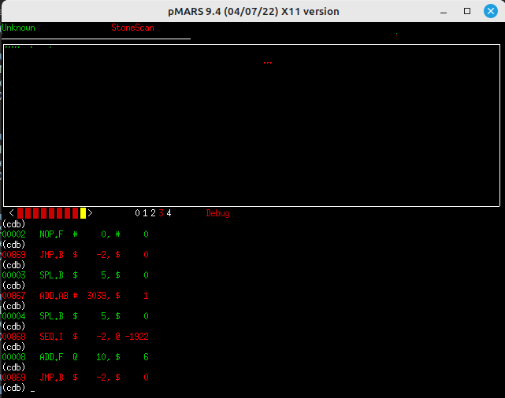
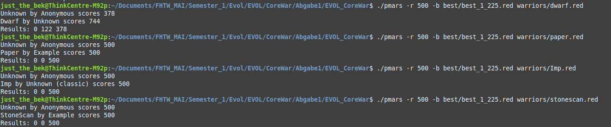

# EVOL_CoreWar

Our groups solution of the Core War assignment of the Evolutionary and Logic-based AI class at FHTW in the first semester.

This project evolves Core War warriors using a Genetic Algorithm (GALib) and evaluates them using the pMARS 0.9.4. simulator.

More about:  
***CoreWar***: https://corewar.co.uk/index.htm  
***Redcode***: https://corewar.co.uk/karonen/guide.htm  
***pMars***:   https://corewar.co.uk/pmars.htm  
***GALib***:   http://lancet.mit.edu/ga/  

---

## 1. Main Idea:

The core idea of this project is to **evolve Core War warriors** using a **Genetic Algorithm (GA)**, creating programs that can survive or even outperform well-known competitors in the Core War virtual machine, *pMars* simulator. The system automatically generates, evaluates, and evolves warriors over multiple generations to improve their performance in simulated battles.

#### Basic Principles

1. **Warrior Encoding**Each warrior is represented as a **genome**: a sequence of integers.

   - Each Core War instruction is encoded as **five integers**: `[opcode, A_mode, A_value, B_mode, B_value]`.
   - The full warrior consists of 15 instructions, resulting in a genome length of 75 integers.
   - This genome representation allows the GA to **mutate and recombine instructions** systematically, enabling evolution.

2. **Genetic Algorithm Setup**The evolution process uses a **1D array genome GA** with standard operators:

   - **Selection:** Warriors with higher fitness are more likely to pass on their genome.
   - **Crossover:** Combines parts of two parent genomes to create offspring.
   - **Mutation:** Slight random changes in the genome introduce variation, allowing exploration of new strategies.

   Users can configure the GA via command-line parameters for **population size, number of generations, mutation probability, and crossover probability**.

3. **Fitness Evaluation**The **fitness function** is the heart of evolution. Each warrior genome is evaluated by running it in **simulated battles against a set of known warriors** (e.g., Dwarf, Imp, Paper).

   - Multiple matches are run in parallel (max. 3 threads) to improve efficiency.
   - Each match contributes a score based on wins, losses, and ties.
   - Variance in match outcomes is penalized to favor **robust, consistent warriors** rather than lucky ones.
   - The GA then selects the warriors with the highest fitness to propagate into the next generation.

4. **Dwarf as Initial Warrior**To provide a **strong starting point**, the evolution process uses the **Dwarf warrior** as a template for initial genomes.

   - Early generations are **biased toward Dwarf’s instruction patterns**, ensuring that the GA starts from a known viable strategy.
   - Mutations in early generations are small, allowing gradual exploration of variations without immediate destructive changes.
   - As generations progress, larger mutations are allowed, enabling the GA to discover new, potentially superior strategies.

5. **Safety Constraints and Strategy Design**To prevent self-destructive behavior during evolution:

   - The first few instructions are treated as a **safe code region**, where dangerous instructions like `DAT` cannot execute.
   - Addressing modes and operand ranges are carefully constrained.
   - Specific rules guide SPL, MOV, and arithmetic operations to balance offensive potential with survival.

   This ensures that evolved warriors remain functional while still exploring innovative attack and defense strategies.

#### How Evolution Works

1. Initialize a population of warriors using **Dwarf-based genomes**.
2. **Evaluate each warrior** in multiple simulated battles against reference opponents.
3. **Assign a fitness score** that rewards wins, penalizes losses, and accounts for consistency.
4. **Select the fittest warriors** to reproduce using crossover and mutation.
5. Repeat for the desired number of generations.
6. Output the **best-performing warrior**.

---

## 2. Repository structure:

.  
├── best                 ← All time best warriors are archived here (manually)  
├── build                ← Build directory for Evolution App  
├── build_and_run.sh     ← Bash script to build and run everything  
├── CMakeLists.txt       ← CMake configuration  
├── galib247             ← Galib sources (tailored to this project)  
├── include              ← Header files of the Evolution App  
│   ├── Config.h  
│   ├── CoreWarEvaluator.h  
│   └── WarriorEncoder.h  
├── knowhow  
├── pmars-0.9.4          ← CoreWar simulator source (tailored to this project)  
├── README.md            ← this README  
├── screenshots          ← Storing results needed by README  
├── src                  ← C++ source files of Evolution App  
│   ├── CoreWarEvaluator.cpp  
│   ├── main.cpp  
│   └── WarriorEncoder.cpp  
├── tmp                  ← Temporary files (used by Evolution App)  
└── warriors             ← Reference warrior programs (used during evolution)  
    ├── dwarf.red  
    ├── Imp.red  
    ├── paper.red  
    └── stonescan.red  

---

## 3. How to run:

The project has a relatively complex structure and relies on two relatively old external libraries (pMars and galib). To allow working with modern C++ they had to be adpoted, therefore the modificated sources are provided here. This also means, that they have to be built directly from the modified source code.

To avoid any confusion a Build&Run script was created which allowes the controll the whole project without destroying anything: **./build_and_run.sh**.

### 3.1. Automation:

1. **Build all targets:**

```
./build_and_run.sh -a
```

2. **Build only Evolution App:**

```
./build_and_run.sh -t app
```

3. **Build and run the Evolution App with default GA parameters:**

```
./build_and_run.sh -t app -r
```

4. **Build and run the Evolution App with custom GA parameters:**

```
./build_and_run.sh -t app -r -p 50 -g 200 -m 0.1 -c 0.8
```

After running the Evolution App the best result lands is placed into the ./build directory, called:  
**best.red**

#### Options

| Option              | Description                                                            |
| ------------------- | ---------------------------------------------------------------------- |
| -a                  | Build**all targets** (`pMars`, `galib`, and Evolution App`). |
| -t`<target>`      | Build a**specific target**: `pMars`, `galib`, or `app`.    |
| -r                  | Run the Evolution App after building (requires `app` built).         |
| -p`<population>`  | Set the GA population size (default:`20`).                           |
| -g`<generations>` | Set the GA number of generations (default:`100`).                    |
| -m`<mutation>`    | Set the GA mutation probability (default:`0.05`).                    |
| -c`<crossover>`   | Set the GA crossover probability (default:`0.9`).                    |
| -h                  | Display this help message.                                             |

#### Build Targets

1. pMars

   - Builds the terminal version first, then the GUI version.
   - Copies binaries to the main directory (`pmars` and `pmars_gui`).
2. galib

   - Builds the GA library using `./build_galib_tester.sh`.
3. Evolution App

   - Uses CMake to generate makefiles in the `build` folder.
   - Builds the GA-based CoreWar Evolution App.
   - Temporary files are stored in `tmp/`.

#### Notes

- The script **exits immediately** on any error (`set -e`).
- Running the Evolution App can take several minutes depending on the GA parameters.
- Build artifacts are copied to the main directory for convenience.
- Temporary files for evaluations are stored in `tmp/`.

### 3.2. Simulator:

The simulator used to calculate the fitnes function can be used to simulate some games manually and to test the created warriors.

If building with 

```
./build_and_run.sh -a
```

the simulator are placed to the root path of the project:
.  
.  
├── pmars  
├── pmars_gui  
.  
.  

If you want to run it without GUI and just get a fast evaluation:

```
./pmars -r 200 warriors/dwarf.red warriors/paper.red
```

The prompted result looks like:

```
Program "Dwarf" (length 5) by "Unknown"

       ORG      START
START  ADD.AB #     4, $     3     
       MOV.I  $     3, @     2     
       JMP.B  $    -2, $     0     
       DAT.F  #     0, #     0     
       DAT.F  #     0, #     0     

Program "Paper" (length 3) by "Example"

       ORG      START
START  MOV.I  $     0, $     1     
       ADD.AB #     1, $     2     
       JMP.B  $    -2, $     0     

Dwarf by Unknown scores 294
Paper by Example scores 153
Results: 47 0 153
```

How to interpret results: <games won by first player> <games first player lost> <equal games>  

If you want to run it witht GUI:

```
./pmars_gui -e -V warriors/dwarf.red warriors/paper.red 
```

This open the GUI windows with the memory visualization. Press s+Enter to start. Afterwards you can step through both player with hitting Enter. For more details and flags simply run:
```
./pmars_gui
```

Look of the simulator GUI:  



---

## 4. Results:

The currently best performing warriors managed to survive 200 rounds against well-known warriors, such as Imp, Paper, Stonescan, and to survive approximately 3/4 of the rounds against Dwarf.  

The all time best warriors produced by different application runs are stored under ./best  

F.E.:Results of best_1_225 against the other warriors:



The warrior best_1_225 was received as a results of an evolution with:

```
./build_and_run.sh -t app -r -p 50 -g 200 -m 0.05 -c 0.9 
```
Attention: runs long!

---

## 5. Limitations:

Although in their current status sometimes the warriors were able to win during the evolutionary "training", this was rather an accidental product of finding them with a very high number of generations and population number, so that they could accidentally win, but supposedly it was the result of their luck that the opponent had been loaded next to them into the pMars memory. We experimented with more aggressive solution variants; however, we couldn't produce them due to lack of time.

---

## 6. Dependencies :

### X11

X11 is needed:

```bash
sudo apt update
sudo apt install libx11-dev
```

### pMars Setup on macOS/Linux

This chapter summarizes the steps taken to compile and run **pMars** on macOS/Linux, including modifications and build instructions.

**Recomendation:** take the source files and the build script checked-in into this project, since it already has been adapted to the needs of the project. Don't try to setup it from scratch, it's too much effort.

### GALib Setup on macOS/Linux

This chapter summarizes the steps taken to compile and run **GALib (Genetic Algorithm Library)** on macOS/Linux, including modifications and build instructions.

**Recomendation:** take the source files and the build script checked-in into this project, since it already has been adapted to the needs of the project. Don't try to setup it from scratch, it's too much effort.

#### I. Source Download

The GALib source code was downloaded from the official GALib website:

- **Website:** [http://lancet.mit.edu/ga/dist/](http://lancet.mit.edu/ga/dist/)
- **Version:** 2.4.7(.tgz)
- **Source files included:**
  - Core library files in `ga/`
  - Examples in `examples/`
  - Documentation in `doc/`

#### II. Source Code Modifications

Several modifications were necessary for successful compilation on modern macOS systems:

1. **Version file issue:**

   - `ga/VERSION` contained `2.4.7` as the first line, which caused a compile error, becuase the compiler wanted to build this file as well.
   - I removed it via renaming it to VERSION.txt
2. **String literal warnings (C++11+):**

   - `gaerror.c` had multiple string literals assigned to `char*`.
   - Warnings such as:
     ```
     ISO C++11 does not allow conversion from string literal to 'char *'
     ```
   - These are harmless but can be fixed later by using `const char*` instead of `char*`.
3. **Deprecated functions:**

   - Warnings for `sprintf()` and `register` keyword occurred in multiple files:
     - `gabincvt.c`, `GA1DBinStrGenome.c`, `GA2DBinStrGenome.c`, `GA3DBinStrGenome.c`
   - These warnings are non-fatal and can be ignored or fixed by switching to `snprintf()` and removing `register`.
4. **C++17 compatibility:**

   - To fix undeclared identifier errors for `initializer` and `mutator` in:

     - `GA1DArrayGenome.c`
     - `GA2DArrayGenome.c`
     - `GA3DArrayGenome.c`
   - The following fixes have been applied:

     4.1 GA1DArrayGenome.c:Replaced calls to `initializer(...)` and `mutator(...)` with:

     ```cpp
     this->initializer(GA1DArrayAlleleGenome<T>::DEFAULT_1DARRAY_ALLELE_INITIALIZER);
     this->mutator(GA1DArrayAlleleGenome<T>::DEFAULT_1DARRAY_ALLELE_MUTATOR);
     ```

     This change was applied at lines 225, 226, 241, and 242.

     4.2 GA2DArrayGenome.c:Replaced calls to `initializer(...)` and `mutator(...)` with:

     ```cpp
     this->initializer(GA2DArrayAlleleGenome<T>::DEFAULT_2DARRAY_ALLELE_INITIALIZER);
     this->mutator(GA2DArrayAlleleGenome<T>::DEFAULT_2DARRAY_ALLELE_MUTATOR);
     ```

     This change was applied at lines 272, 273, 289, and 290.

     4.3 GA3DArrayGenome.c:Replaced calls to `initializer(...)` and `mutator(...)` with:

     ```cpp
     this->initializer(GA3DArrayAlleleGenome<T>::DEFAULT_3DARRAY_ALLELE_INITIALIZER);
     this->mutator(GA3DArrayAlleleGenome<T>::DEFAULT_3DARRAY_ALLELE_MUTATOR);
     ```

     This change was applied at lines 325, 326, 342, and 343.
   - The library was built using **C++98** standard:

   ```bash
   g++ -std=c++98 ...
   ```
5. **Unused variables warnings:**

   - `GA3DArrayGenome.c` contained unused variables `maxx`, `maxy`, `maxz`.
   - Harmless, can be silenced with `(void)maxx;` etc.

#### III. Build Process

1. **Compile the library files**

   - From the `ga/` directory, compile all `.c` files with:
     ```bash
     make CXX="g++ -std=c++98"
     ```
   - This produces `.o` object files and builds `libga.a`.
2. **Verify compilation**

   - Compilation may produce warnings about deprecated `register` and `sprintf()`.
   - All `.o` files are archived into `libga.a` using `ar rv libga.a ...`.
3. **Prepare the tester shell script**

   - A shell script `build_galib_tester.sh` was created to compile the test program:
     ```bash
     #!/bin/bash
     echo "Compiling galib_tester.cpp..."
     g++ -I./ga -L. galib_tester.cpp -lga -o galib_tester
     ```
   - `-I./ga` tells the compiler where to find GALib headers.
   - `-L.` tells the linker to look in the current directory for `libga.a`.
   - `-lga` links against the compiled GALib library.
4. **Run the tester**

   - Make the script executable and run it:
     ```bash
     chmod +x build_galib_tester.sh
     ./build_galib_tester.sh
     ./galib_tester
     ```
   - Output:
     ```
     GALib is working!
     ```

#### IV. Notes

- Warnings during compilation are mostly due to legacy code using deprecated C++ constructs and string literals.
- Using `C++98` ensures `initializer` and `mutator` are correctly recognized.
- Once compiled, `libga.a` can be linked into any C++ project using GALib.

#### V. Directory Structure

After building, the key directories and files are:

galib247/  
├── ga/ # Core library files  
│ ├── libga.a # Compiled static library  
│ ├── *.c, *.h # Source and headers  
│ └── ...  
├── galib_tester.cpp # Test program  
├── build_galib_tester.sh # Shell script to build tester  
└── doc/ # Documentation  

#### VI. Summary

1. Downloaded GALib 2.4.7 from [MIT GALib site](http://lancet.mit.edu/ga/).
2. Built library using `g++ -std=c++98` to maintain compatibility.
3. Resolved header and `initializer`/`mutator` issues.
4. Created `build_galib_tester.sh` to compile a test program.
5. Verified installation using `./galib_tester` → output confirms library is working.

GALib is now fully functional and ready for use in C++ genetic algorithm projects on macOS/Linux.
